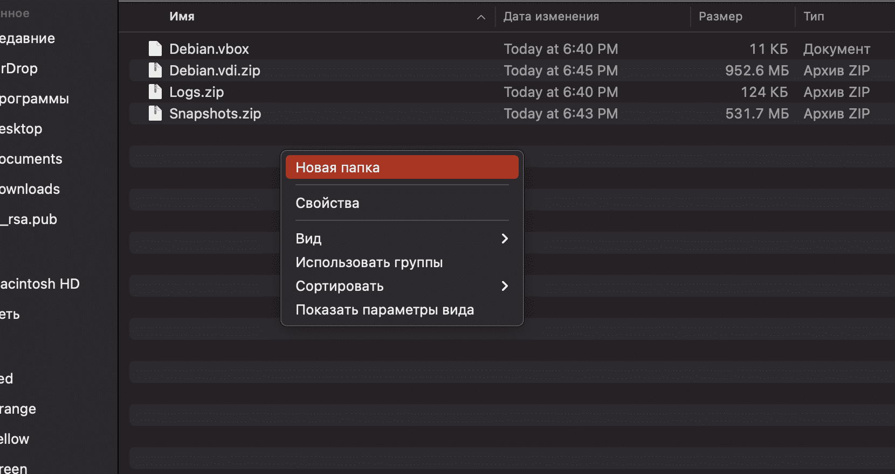

# Storing configuration in the cloud

When working on a project, you may need to transfer the configuration to another computer. To some this may seem stupid, because you can do everything with the same PeKa and not worry about it. But for a party that has survived several waves of pool players and the total filling of clusters in the summer, the portability of the project will not be stupid, but the main useful feature.

To transfer the project, you can use your phone, flash drive or cloud. In this example I will use the cloud.

It is also necessary to learn how to create snapshots - snapshots of the system state, and save the system with them.

## Step 1. Learn to create snapshots

Snapshot is a snapshot of the system state. It is similar to saving in a game. Just as in a computer game you shouldn’t move to the next level without saving, in the inception project you shouldn’t make rash actions without taking snapshots. If something suddenly goes wrong, the system can be rolled back to the previous snapshot.

They say that one guy did not make backups and snapshots. We can see what happened to him after the project crash in our favorite sticker pack:

So, let's begin.

> Attention! The virtual machine must be turned off to create the snapshot!

We go into virtualbox and go to the “snapshots” menu.

At the top, click on the green plus sign that says “make” and describe our changes.

This gives us a snapshot of our current changes:

If something goes wrong, you won’t have to delete and redo the configuration; you can simply roll back to the previous working configuration.

## Step 2. Find the installed configuration

Go to the folder on goinfre, where our configuration is stored. If we look at the file sizes, we will find that the .vhd disk weighs more than 2 gigabytes (in my case, almost three gigabytes), and most modern cloud storages do not support files larger than two gigabytes.

## Step 3. Compress large files

There is an exit! ~~via login~~ You need to compress the .vhd file and folders. Now our disk, instead of 3 gigabytes, weighs 950 megabytes!

## Step 4. Upload files to the cloud

This configuration weighs only 1.38 GB including snapshots. Now it can be downloaded and deployed on any school Mac and even on a home PC/Laptop.

On a school Mac, you don’t even have to change the configuration in virtualbox - just create a folder in a new location with the same name and the same path in goinfre, download the files there and unpack them, and then launch virtualbox. The configuration will work the same as on the previous PC.

For subsequent transfer, after all the saved changes, you will need to take a new snapshot, compress the files and upload them to the cloud again.

## Step 5. Running the configuration on another school Mac

If we log in to another computer, we will unfortunately discover that there is nothing from goinfree on it, and our configuration is not there either:

To save files, we will most likely have to slightly change the browser settings:

We download our configuration from the cloud to goinfree and create a folder that has the same name as the folder of our previous configuration at the previous location:

Let's unzip all our archives and get the following:

Let's go to virtualbox and see that our configuration works:

And for deployment on a home PC/Laptop, we will need to download and unzip the configuration, and then in the virtualbox “Tools” tab, click on the green plus sign “Add”, specifying the folder with the Debian.vbox file and other files.

